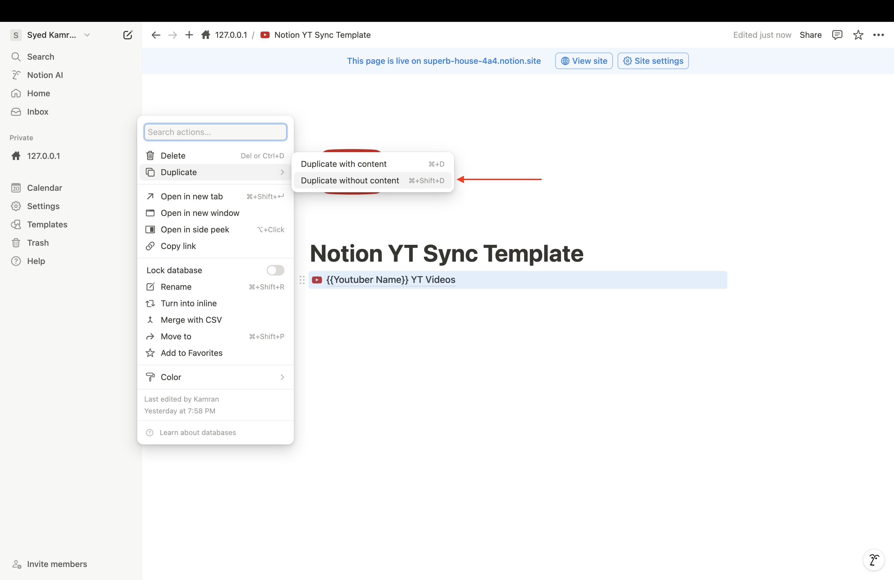
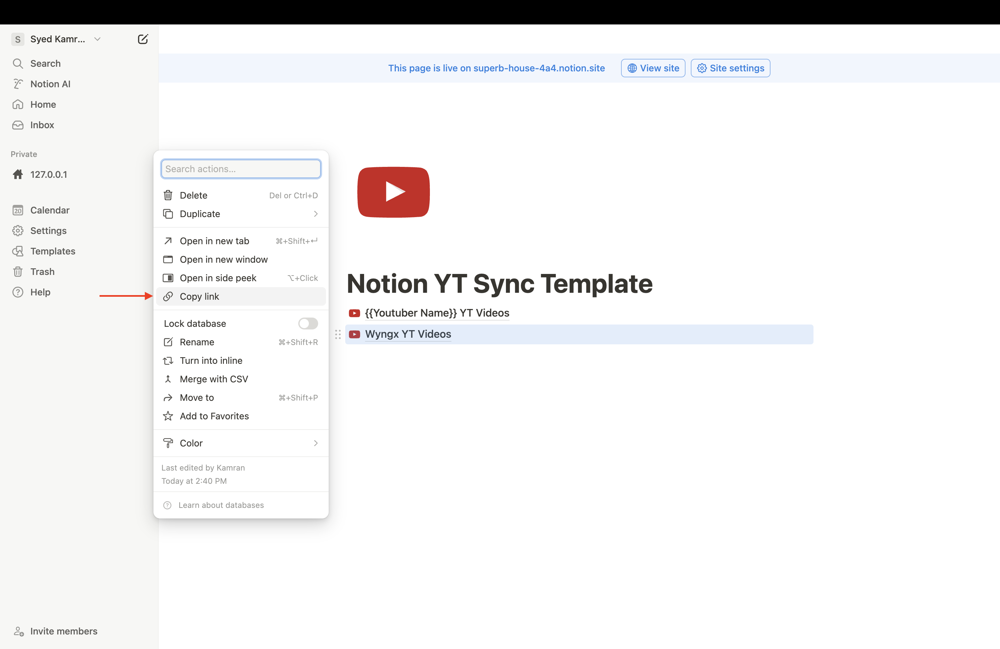

## Notion YouTube Sync (`notion-yt-sync`)
`notion-yt-sync` helps you track YouTube videos uploaded by your favorite creators in a Notion database.

### Why I Built This
I follow several YouTube channels closely, and it became challenging to track the videos I've watched and the notes I took. Since I use Notion extensively, I wanted an automated solution to manage all video uploads and track which videos I've watched, along with the corresponding notes, all in one place. So, I built `notion-yt-sync`.

### Setup Instructions

#### Step 1: Duplicate the Notion YT Sync Template
Go to [Notion YT Sync Template](https://superb-house-4a4.notion.site/Notion-YT-Sync-Template-124a0c220c5280b08cf8ec5a981a2ad8) and click the `Duplicate` button.

> 

#### Step 2: Create a Notion Internal Integration
Visit [Notion Integrations](https://www.notion.so/profile/integrations) and follow these steps:

1. Create a new internal integration.
    > 

2. Use your own Notion workspace.
   > 

3. Complete integration setup.
   > 

4. Confirm that your integration is visible on the integrations page.
   > 
   
   > 

#### Step 3: Connect the Integration to Your Notion YT Sync Template

1. Open the template page.
   > 

2. Connect your internal integration.
   > 

3. Confirm the connection.
   > 

#### Step 4: Setup the project locally

1. Clone the repository
```bash
git clone https://github.com/skamranahmed/notion-yt-sync
```

2. Navigate to the repository directory
```bash
cd notion-yt-sync
```

3. Configure the env variables
- Ensure you are in the root directory of the project.

- Copy the contents of the `.env.example` file to a new `.env` file:
```bash
cp .env.example .env
```

#### Step 5: How to Obtain the Notion Database ID?

In the `.env` file, you will find two variables: `NOTION_DATABASE_ID_WYNGX` and `NOTION_DATABASE_ID_VERITASIUM`. Below are the steps to obtain the value for `NOTION_DATABASE_ID_WYNGX`. The process is similar for the other variable and any new variable which you might add

1. Open the template page and create a new database by duplicating the existing database template.
   > 

2. A new database will be created. You can edit its name; in this case, I would rename to Wyngx YT Videos as this will store the YT videos for the Wyngx channel.
   > 

3. Copy the link of the newly created database.
   > 

4. The database ID is the portion of the URL that appears after `https://www.notion.so/` and before the `?`:
   > `https://www.notion.so/YourDatabaseID?v=SomeVersionID&pvs=SomeParameter`

5. Copy the database ID (denoted as `YourPageID` in the example) and paste it under the `NOTION_DATABASE_ID_WYNGX` variable in the `.env` file.

#### Step 6: Running the project locally

1. Ensure `poetry` is installed 
   > If Poetry is not installed on your system, follow the [installation guide here](https://python-poetry.org/docs/#installation).

2. Install dependencies 
```bash
poetry install --no-root
```

3. Verify Environment Setup
   > Ensure all required values are correctly set in the `.env` file and that the Notion setup from the previous steps is complete.

4. Run the project
```bash
poetry run python main.py
```

5. Videos will start getting inserted in your Notion database
   > 

6. Videos successfully inserted in your Notion database
   > 

#### Step 7 (Optional): Push the project to your own GitHub and automate with GitHub Actions

You can clone this project, customize it to fit your needs, and push it to your own GitHub repository. By default the script will run daily at midnight (00:00) via GitHub Actions.

### Todo 📝

- [ ] Write a Dockerfile
- [ ] Write instructions to run the project via Docker
- [ ] Create a Makefile

### License

This project is licensed under the [MIT License](https://choosealicense.com/licenses/mit/)
